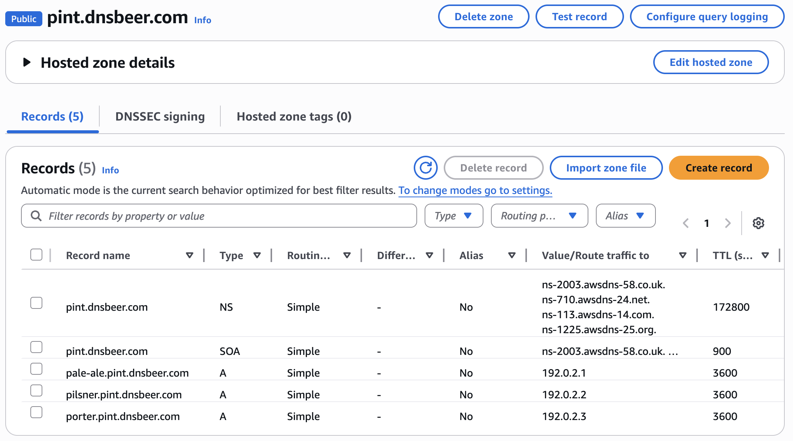

# DNSControlやoctoDNSを利用したゾーンデータの引っ越し方法の紹介
<!--
class: title
_header: ""
_footer: ""
_paginate: false
-->

- DNS Summer Day 2025（2025年6月27日）登壇資料
- 所属：さくらインターネット株式会社
- 氏名：滝澤隆史

## 自己紹介
<!--
class: body
-->

- 氏名：滝澤隆史
- 所属：さくらインターネット株式会社
    - さくらのクラウドの中の人をやっている
- DNSとの関わり
    - 趣味として何となくDNSで遊んでいる人

## 概要

“DNS as Code”のツール（DNSControlやoctoDNS）を利用したゾーンデータの引っ越し方法を紹介する。
　
　
　
注記：「ゾーンデータの引っ越し」のみを対象とし、レジストラー関連（ネームサーバー変更申請）、他は対象外とする。

## “DNS as Code”とは
<!--
class: heading
-->

### DNS Summar Day 2024
<!--
class: body
-->

- 『[DNS as Code — CI/CDを利用したゾーン運用 —](https://www.docswell.com/s/1191583649/K1J1VR-2024-06-19-141753)』

    

### “DNS as Code”とは

- Infrastructure as CodeをDNSに特化したもの
- DNSゾーンの状態をコードで定義し、APIによりDNSプロバイダーのゾーンに反映させる

    

### “DNS as Code”の実装

- “DNS as Code”の実装として、複数のDNSプロバイダーに対応したものには以下のものがある
    - DNSControl
    - octoDNS

### DNSControlとは

- Stack Exchange社が開発・保守しているDNSゾーンの保守ツール
- 公式サイト
    - https://docs.dnscontrol.org/
- ゾーンファイルをAPIでDNSプロバイダーに反映させる


### DNSControlとは

- ゾーンファイル
    - JavaScriptベースのDSL

公式サイトの例より

```js
D("example.com", REG_MY_PROVIDER, DnsProvider(DSP_MY_PROVIDER),
    A("@", "1.2.3.4"),  // The naked or "apex" domain.
    A("server1", "2.3.4.5"),
    AAAA("wide", "2001:0db8:85a3:0000:0000:8a2e:0370:7334"),
    CNAME("www", "server1"),
    CNAME("another", "service.mycloud.com."),
    MX("mail", 10, "mailserver"),
    MX("mail", 20, "mailqueue"),
    TXT("the", "message"),
    NS("department2", "ns1.dnsexample.com."), // use different nameservers
    NS("department2", "ns2.dnsexample.com."), // for department2.example.com
);
```

### DNSControlとは

- 実行コマンド
    - DNSプロバイダーからゾーンデータの取得
        - `dnscontrol get-zones`
    - ゾーンデータのDNSプロバイダーへの同期 (dry run)
        - `dnscontrol preview`
    - ゾーンデータのDNSプロバイダーへの同期
        - `dnscontrol push`

### octoDNSとは

- GitHub社が開発・保守しているDNSゾーンの保守ツール
- 公式サイト
    - https://github.com/github/octodns
- ソースとして指定したDNSプロバイダーのゾーンデータをAPIでターゲットのDNSプロバイダーに反映させる


### octoDNSとは

- ゾーンファイル
    - YAML形式
        - 公式サイトの例より

            ```yaml
            ---
            '':
              ttl: 60
              type: A
              values:
                - 1.2.3.4
                - 1.2.3.5
            ```

    - マスターファイル形式


### octoDNSとは

- 実行コマンド
    - ソースプロバイダーからターゲットプロバイダーへの同期 (dry run)
        - `octodns-sync --config-file config.yml`
    - ソースプロバイダーからターゲットプロバイダーへの同期
        - `octodns-sync --config-file config.yml --doit`
- ゾーンファイルを扱うときにはプロバイダーとして次のいずれかを指定する
    - YamlProvider: YAML形式
    - ZoneFileSource: マスターファイル形式

## ゾーンデータの引っ越し
<!--
class: heading
-->

### ゾーンデータの引っ越しのフロー
<!--
class: body
-->

- ゾーンファイルを介在する方法
    1. 移行元プロバイダーからゾーンデータの取得
        
    2. ゾーンファイルの修正（調整）
    3. 移行先プロバイダーへのゾーンデータの反映
        

### ゾーン移行のフロー

- ゾーンファイルを介在しない方法（octoDNSのみ）
    
    - 移行元と移行先の権威DNSサーバーは異なるため、別途、ゾーン頂点のNSレコードの処理が必要である
        - octoDNSにはIgnoreRootNsFilterが用意されている

### DNSControlとoctoDNSのどちらを使う？

- DNSControlとoctoDNSの2つのツールがあることはわかった
- では、どちらを使えばいいの？
- ゾーンデータの引っ越しに利用する際の特徴を見てみる

### DNSControlの特徴

- ゾーンファイル
    - JavaScriptベースの独自のDSL
        - 学習コストが発生
- ゾーン移行
    - ゾーンファイルを介在する必要がある

### DNSControlの特徴

- プロバイダーパッケージのRRタイプのサポート
    - HTTPSのような新しめのRRタイプのサポートも行われている
- サポートしていないRRタイプのレコードがあるとき
    - エラーが発生する

### octoDNSの特徴

- ゾーンファイル
    - YAMLベースのDSL
        - 学習コストが発生
        - 公式文書の説明不足
    - マスターファイル形式
        - 学習コストは不要
- ゾーン移行
    - ゾーンファイルを介在せずに移行することもできる

### octoDNSの特徴

- プロバイダーモジュールのRRタイプのサポート
    - HTTPSのような新しめのRRタイプのサポートはほとんど行われていない
- サポートしていないRRタイプのレコードがあるとき
    - ソースプロバイダー
        - 無視される（エラーは発生しない）
    - ターゲットプロバイダー
        - 設定`strict_supports: true`の場合：エラーが発生する
        - 設定`strict_supports: false`の場合：ワーニングが出力される

### DNSControlとoctoDNSのどちらを使う？

- DNSControl
    - HTTPSのような新しめのRRタイプを利用している場合
    - JavaScriptベースのDSLに抵抗感がない場合
- octoDNS
    - HTTPSのような新しめのRRタイプを利用していない場合
    - マスターファイル形式のゾーンファイルを使いたい場合

## ゾーンデータの引っ越し作業の注意点
<!--
class: heading
-->

### APIキー
<!--
class: body
-->

- DNSControlやoctoDNSではDNSプロバイダーのAPIキーを利用する
- APIキーの権限
    - リソースレコードの作成・変更・削除の権限が必要である
    - ゾーンを作成するときには、ゾーンを作成する権限が必要である
        - ゾーンを作成する権限が付与できない
            - DNSプロバイダーのウェブコンソールからゾーンを作成する

### ゾーンの作成がツールからできない

- DNSプロバイダーによってはツールからゾーンの作成ができない
    - DNSプロバイダーのウェブコンソールからゾーンを作成する

### 利用できないRRタイプがある

- DNSプロバイダー側の制約
    - DNSプロバイダーがそもそも対応していない
- ツール側の制約
    - DNSプロバイダーは対応しているけど、ツールのプロバイダーモジュールが対応していない
- 特にHTTPSやSVCBのような新しめのRRタイプへの対応が異なる
    - octoDNSはほとんど対応していない
- 実際に利用するプロバイダーおよびツールのモジュールに対するサポート状況を確認する

### SOAとゾーン頂点のNSが取得・更新できない

- DNSプロバイダーによってはSOAとゾーン頂点のNSがプロバイダーにより決められたものに固定されていて、取得・更新できない
    - ゾーンを引っ越しすると権威ネームサーバーは変更になるので、移行先のDNSプロバイダーの指示に従う
- 実際に利用するプロバイダーおよびツールのモジュールに対するサポート状況を確認する必要がある

### 確認方法: DNSControl

- [公式サイトのSupported providers](https://docs.dnscontrol.org/provider/index)を確認する
    
- "dual host"はNSレコードを登録できることを示す
- "create-domains"はゾーンの作成ができることを示す

### 確認方法: octoDNS

- [GitHubのプロバイダーモジュール](https://github.com/octodns/octodns?tab=readme-ov-file#providers)のリポジトリのページを確認する
    
- ツールからゾーンの作成可能かは記載がないため、試すしかない

### リソースレコードに制約がある

- DNSプロバイダーによってはOWNERやRDATAに制約がある
    - 制約が起因と思われるAPIのエラーが発生したら、DNSプロバイダーのドキュメントを確認する

### DNSプロバイダーによってAPIによる更新方法が異なる

- ゾーン一括で更新
- RRsetごとに更新
    - →更新対象のレコード数が多いと更新に時間がかかる
    - レートリミットを回避するため1秒ごとにリクエストを送ると1000レコードを更新するのに約1000秒かかる

## ゾーンデータの引っ越しの例
<!--
class: heading
-->

### ゾーンデータの引っ越しの例
<!--
class: body
-->

- ツール：DNSControl
- 移行元：Amazon Route 53
- 移行先：さくらのクラウド DNS

デモを実演したいところだが、PCや通信環境の状況により失敗するリスクがあるので、実際に実行したコマンドを掲載する。

※octoDNSの例はおまけに記載しているので、興味がありましたら資料をダウンロードしてご確認ください。

### DNSControlのインストール
<!--
class: body
-->

- 公式サイトのOverviewのページに記載の方法のいずれかでインストールする
    - https://docs.dnscontrol.org/getting-started/getting-started
    - Homebrew, Docker, GitHub releases, go install

### 設定ファイルの作成

- プロバイダーの設定ファイルcreds.jsonを作成する

    ```json
    {                                                                          
      "route53": {
        "TYPE": "ROUTE53",
        "KeyId": "$AWS_ACCESS_KEY_ID",
        "SecretKey": "$AWS_SECRET_ACCESS_KEY"
      },
      "sakuracloud": {
        "TYPE": "SAKURACLOUD",
        "access_token": "$SAKURACLOUD_ACCESS_TOKEN",
        "access_token_secret": "$SAKURACLOUD_ACCESS_TOKEN_SECRET"
      }
    }
    ```

    ※ $で始まる文字列は環境変数から読み取ることを意味する

### 認証を確認する

- 認証情報を環境変数に設定する
- 認証情報が正しい確認する

    ```
    dnscontrol check-creds <credkey>
    ```

- 実行例

    ```sh
    $ dnscontrol check-creds route53
    pint.dnsbeer.com    ←移行元のゾーン名一覧が出力される
    bottle.dnsbeer.com

    $ dnscontrol check-creds sakuracloud
                        ←移行先のゾーン名一覧が出力される
                        （何もなければ出力されない）
    ```

### 移行元ゾーンの確認

- SOAレコードとNSレコード以外には3個のリソースレコードがある

    

### 移行元プロバイダーからゾーンデータを取得する

- 移行元プロバイダーからゾーンデータを取得する

    ```
    dnscontrol get-zones --format=js --out=dnsconfig.js <credkey> - <zone> ...
    ```

    - `--format=js`を指定するとDNSControlのゾーンファイルの形式になる
    - `dnsconfig.js`はゾーンファイルのデフォルトのファイル名

- 実行例

    ```sh
    $ dnscontrol get-zones --format=js --out=dnsconfig.js route53 - pint.dnsbeer.com
    ```

    - ※全ゾーンを一括で取得するときにはゾーン名に`all`を指定する

### dnsconfig.jsの確認

```js
// generated by get-zones. This is 'a decent first draft' and requires editing.

var DSP_ROUTE53 = NewDnsProvider("route53");
var REG_CHANGEME = NewRegistrar("none");

D("pint.dnsbeer.com", REG_CHANGEME,
        DnsProvider(DSP_ROUTE53),
        DefaultTTL(3600),
        //NAMESERVER("ns-2003.awsdns-58.co.uk."),
        //NAMESERVER("ns-710.awsdns-24.net."),
        //NAMESERVER("ns-113.awsdns-14.com."),
        //NAMESERVER("ns-1225.awsdns-25.org."),
        A("pale-ale", "192.0.2.1"),
        A("pilsner", "192.0.2.2"),
        A("porter", "192.0.2.3"),
);
```

### dnsconfig.jsの修正

```js
var DSP_SAKURACLOUD = NewDnsProvider("sakuracloud");
var REG_CHANGEME = NewRegistrar("none");
                                                                           
D("pint.dnsbeer.com", REG_CHANGEME,
        DnsProvider(DSP_SAKURACLOUD),
        DefaultTTL(3600),
        A("pale-ale", "192.0.2.1"),
        A("pilsner", "192.0.2.2"),
        A("porter", "192.0.2.3"),
);
```

- `NewDnsProvider()`の引数を移行先の`sakuracloud`に書き換え
- `DSP_ROUTE53`を移行先の`DSP_SAKURACLOUD`に書き換え
- `NAMESERVER`を削除あるいは変更（移行先のNSレコードがわかっているときにはそれを指定する）

### ゾーンデータを移行先に反映（dry run）

- ゾーンデータを移行先に反映する（dry run）

    ```
    dnscontrol preview
    ```

### ゾーンデータを移行先に反映（dry run）

- 実行例

    ```sh
    $ dnscontrol preview                                                       
    ******************** Domain: pint.dnsbeer.com
    1 correction (sakuracloud)
    #1: Ensuring zone "pint.dnsbeer.com" exists in "sakuracloud"
    Adding zone for pint.dnsbeer.com to Sakura Cloud account
    SUCCESS!
    CONCURRENTLY gathering 0 zone(s)
    SERIALLY gathering 1 zone(s)
    Serially Gathering: "pint.dnsbeer.com"
    ******************** Domain: pint.dnsbeer.com
    3 corrections (sakuracloud)
    #1: + CREATE pale-ale.pint.dnsbeer.com A 192.0.2.1 ttl=3600
    + CREATE pilsner.pint.dnsbeer.com A 192.0.2.2 ttl=3600
    + CREATE porter.pint.dnsbeer.com A 192.0.2.3 ttl=3600
    Done. 4 corrections.
    ```

    - このとき、ゾーンの作成は実際に行われる

### ゾーンデータを移行先に反映（dry run）

- 移行先プロバイダーがゾーン頂点のNSレコードを変更できる場合、NSレコードに対して`± MODIFY-TTL`、`MODIFY`、`DELETE`が出力されることがある

    ```
    #1: ± MODIFY-TTL pint.dnsbeer.com NS ns01.example.org. ttl=(172800->300)
    ± MODIFY-TTL pint.dnsbeer.com NS ns02.example.org. ttl=(172800->300)
    ```

- このまま、反映するとNSレコードの値が変更されるため、dnsconfig.jsの修正が必要である

### ゾーンデータを移行先に反映（dry run）

- 先の出力に基づき、`NAMESERVER_TTL`と`NAMESERVER`を追記する

    ```js
    var DSP_SAKURACLOUD = NewDnsProvider("sakuracloud");
    var REG_CHANGEME = NewRegistrar("none");
                                                                               
    D("pint.dnsbeer.com", REG_CHANGEME,
            DnsProvider(DSP_SAKURACLOUD),
            DefaultTTL(3600),
            NAMESERVER_TTL("172800"), 
            NAMESERVER("ns01.example.org."),
            NAMESERVER("ns02.example.org."),
            A("pale-ale", "192.0.2.1"),
            A("pilsner", "192.0.2.2"),
            A("porter", "192.0.2.3"),
    );
    ```

- 再度、`dnscontrol preview`を実行し、NSレコードの変更が出力されないことを確認する

### ゾーンデータを移行先に反映

- ゾーンデータを移行先に反映する

    ```
    dnscontrol push
    ```

### ゾーンデータを移行先に反映

- 実行例

    ```sh
    $ dnscontrol push                                                          
    CONCURRENTLY gathering 0 zone(s)
    SERIALLY gathering 1 zone(s)
    Serially Gathering: "pint.dnsbeer.com"
    ******************** Domain: pint.dnsbeer.com
    3 corrections (sakuracloud)
    # 1: + CREATE pale-ale.pint.dnsbeer.com A 192.0.2.1 ttl=3600
    - CREATE pilsner.pint.dnsbeer.com A 192.0.2.2 ttl=3600
    - CREATE porter.pint.dnsbeer.com A 192.0.2.3 ttl=3600
    SUCCESS!
    Done. 3 corrections.
    ```

    - 3個のリソースレコードが作成された

### 移行先ゾーンの確認

- 3個のリソースレコードがある
- NSとSOAは、固定であり編集できないため、一覧にはない

    

### ゾーンデータの検証

- DNSプロバイダーのウェブコンソールからゾーンに登録されているレコード数が同じであることを確認してみる
    - このとき、NSとSOAを除いた数を比較する
    - DNSプロバイダーによってはRRsetが1個扱いになっていることもあるため、この方法は確実ではない
    - リソースレコードがすべて同じであることは確認できていない

### ゾーンデータの検証

- 移行元・移行先からマスターファイル形式でゾーンデータを取得する

    ```
    $ dnscontrol get-zones --format=zone \
        route53 - pint.dnsbeer.com | \
        grep -vE '^(@|\s).+ (NS|SOA) ' > route53-pint.dnsbeer.com.zone
    $ dnscontrol get-zones --format=zone \
        sakuracloud - pint.dnsbeer.com | \
        grep -vE '^(@|\s).+ (NS|SOA) ' > sakuracloud-pint.dnsbeer.com.zone
    ```

    - このとき、ゾーン頂点に対するNSレコードとSOAレコードを除外する

### ゾーンデータの検証

- ソート結果を比較する

    ```
    $ diff -u <(sort route53-pint.dnsbeer.com.zone) \
              <(sort sakuracloud-pint.dnsbeer.com.zone)
    （出力なし）
    ```

    - 意図しない差分がなければゾーンデータは同じであると判断できる

## まとめ
<!--
class: heading
-->

### まとめ
<!--
class: body
-->

- “DNS as Code”のツールDNSControlやoctoDNSを利用したゾーンデータの引っ越し方法を紹介した

## おまけ
<!--
class: heading
-->

### おまけ
<!--
class: body
-->

- octoDNSを利用した移行例（ゾーンファイルを介在する方法）
- octoDNSを利用した移行例（ゾーンファイルを介在しない方法）
- DNSControlでマスターファイル形式のゾーンファイルの利用例

## octoDNSを利用した移行例<br>（ゾーンファイルを介在する方法）
<!--
class: heading
-->

### octoDNSのインストール
<!--
class: body
-->

1. Pythonの仮想環境を作成して有効にする

    ```sh
    $ python3 -m venv .venv
    $ source ./.venv/bin/activate
    ```

2. octoDNSをインストールする

    ```
    $ pip3 install octodns
    ```

3. 移行元と移行先のプロバイダーモジュールをインストールする

    ```
    $ pip3 install octodns-route53 octodns-sakuracloud
    $ pip3 install octodns-bind  ←ゾーンファイルを扱うため
    ```

### ゾーンファイルを格納するディレクトリの作成

- ゾーンファイルを格納するディレクトリを作成する

    ```sh
    $ mkdir zones
    ```

### 設定ファイルの作成

- 設定ファイルconfig.ymlを作成する
- プロバイダー情報を`providers`に定義する

    ```yaml
    providers:                                                                         
      route53:
        class: octodns_route53.Route53Provider
        access_key_id: env/AWS_ACCESS_KEY_ID
        secret_access_key: env/AWS_SECRET_ACCESS_KEY
      sakuracloud:
        class: octodns_sakuracloud.SakuraCloudProvider
        access_token: env/SAKURACLOUD_ACCESS_TOKEN
        access_token_secret: env/SAKURACLOUD_ACCESS_TOKEN_SECRET
      zonefile:
        class: octodns_bind.ZoneFileSource
        directory: ./zones
        file_extension: .zone
        check_origin: false
    ```

    - `env/`は環境変数から読み取ることを意味する

### 設定ファイルの作成

- 移行元プロバイダーからゾーンデータを取得するためのゾーンの情報を`zones`に定義する

    ```yaml
    zones:
      pint.dnsbeer.com.:
        sources:
          - route53
        targets:
          - zonefile
    ```

- 設定ファイルを検査する

    ```
    octodns-validate --config-file config.yml
    ```

### 移行元ゾーンの確認

- SOAレコードとNSレコード以外には3個のリソースレコードがある

    

### 移行元プロバイダーからゾーンデータを取得する

- 認証情報を環境変数に設定する
- 移行元プロバイダーからゾーンデータを取得する

    ```
    octodns-sync --config-file config.yml --doit
    ```

### 移行元プロバイダーからゾーンデータを取得する

- 実行例

    ```
    (.venv) $ octodns-sync --config-file config.yml
    略
    ********************************************************************************
    * pint.dnsbeer.com.
    ********************************************************************************
    * zonefile (ZoneFileProvider)
    *   Create Zone<pint.dnsbeer.com.>
    *   Create <NsRecord NS 172800, pint.dnsbeer.com., [...]> (route53)
    *   Create <ARecord A 3600, pale-ale.pint.dnsbeer.com., ['192.0.2.1']> (route53)
    *   Create <ARecord A 3600, pilsner.pint.dnsbeer.com., ['192.0.2.2']> (route53)
    *   Create <ARecord A 3600, porter.pint.dnsbeer.com., ['192.0.2.3']> (route53)
    *   Summary: Creates=4, Updates=0, Deletes=0, Existing=0, Meta=False
    ********************************************************************************


    2025-06-18T22:15:04  [8428625664] INFO  ZoneFileProvider[zonefile] apply: making
     4 changes to pint.dnsbeer.com.
    2025-06-18T22:15:04  [8428625664] INFO  Manager sync:   4 total changes
    ```

### ゾーンファイルの確認

- ゾーンファイルが`zones/pint.dnsbeer.com.zone`に作成されるので確認する

```
$ORIGIN pint.dnsbeer.com.
                                                                                              
@ 3600 IN SOA ns-113.awsdns-14.com. webmaster.pint.dnsbeer.com. (
    1750252504 ; Serial
    3600 ; Refresh
    600 ; Retry
    604800 ; Expire
    3600 ; NXDOMAIN ttl
)

; Name: pint.dnsbeer.com.
@          172800 IN NS       ns-113.awsdns-14.com.
           172800 IN NS       ns-1225.awsdns-25.org.
           172800 IN NS       ns-2003.awsdns-58.co.uk.
           172800 IN NS       ns-710.awsdns-24.net.
pale-ale     3600 IN A        192.0.2.1
pilsner      3600 IN A        192.0.2.2
porter       3600 IN A        192.0.2.3
```

### ゾーンファイルの修正

```
$ORIGIN pint.dnsbeer.com.

pale-ale     3600 IN A        192.0.2.1
pilsner      3600 IN A        192.0.2.2
porter       3600 IN A        192.0.2.3
```

- SOAレコードを削除（移行先はSOAレコードを変更できないため）
- NSレコードを削除（移行先はNSレコードを変更できないため）

### 設定ファイルの修正

- ゾーンファイルを移行先プロバイダーに同期するためのゾーンの設定に書き換える

    ```
    zones:
      pint.dnsbeer.com.:
        sources:
          - zonefile
        targets:
          - sakuracloud
    ```

- 設定ファイルを検査する

    ```
    octodns-validate --config-file config.yml
    ```

### ゾーンデータを移行先に反映（dry run）

- ゾーンデータを移行先に反映する（dry run）

    ```
    octodns-sync --config-file config.yml
    ```

### ゾーンデータを移行先に反映（dry run）

- 実行例

    ```
    (.venv) $ octodns-sync --config-file config.yml
    略
    ********************************************************************************
    * pint.dnsbeer.com.
    ********************************************************************************
    * sakuracloud (SakuraCloudProvider)
    *   Create Zone<pint.dnsbeer.com.>
    *   Create <ARecord A 3600, pale-ale.pint.dnsbeer.com., ['192.0.2.1']> ()
    *   Create <ARecord A 3600, pilsner.pint.dnsbeer.com., ['192.0.2.2']> ()
    *   Create <ARecord A 3600, porter.pint.dnsbeer.com., ['192.0.2.3']> ()
    *   Summary: Creates=3, Updates=0, Deletes=0, Existing=0, Meta=False
    ********************************************************************************
    ```

### ゾーンデータを移行先に反映

- ゾーンデータを移行先に反映する

    ```
    octodns-sync --config-file config.yml --doit
    ```

### ゾーンデータを移行先に反映

- 実行例

    ```
    (.venv) $ octodns-sync --config-file config.yml --doit
    略
    ********************************************************************************
    * pint.dnsbeer.com.
    ********************************************************************************
    * sakuracloud (SakuraCloudProvider)
    *   Create Zone<pint.dnsbeer.com.>
    *   Create <ARecord A 3600, pale-ale.pint.dnsbeer.com., ['192.0.2.1']> ()
    *   Create <ARecord A 3600, pilsner.pint.dnsbeer.com., ['192.0.2.2']> ()
    *   Create <ARecord A 3600, porter.pint.dnsbeer.com., ['192.0.2.3']> ()
    *   Summary: Creates=3, Updates=0, Deletes=0, Existing=0, Meta=False
    ********************************************************************************


    2025-06-18T22:24:29  [8428625664] INFO  SakuraCloudProvider[sakuracloud] apply: 
    making 3 changes to pint.dnsbeer.com.
    2025-06-18T22:24:33  [8428625664] INFO  Manager sync:   3 total changes
    ```

### 移行先ゾーンの確認

- 3個のリソースレコードがある
- NSとSOAは、固定であり編集できないため、一覧にはない

    

### ゾーンデータの検証

- ゾーンデータを検証する

    ```
    octodns-compare --config-file config.yml --a SOURCE --b TARGET --zone ZONE
    ```

- 実行例

    ```
    (.venv) $ octodns-compare --config-file config.yml --a route53 \
      --b sakuracloud --zone pint.dnsbeer.com.
    略
    [Create <NsRecord NS 172800, pint.dnsbeer.com., [...]> (route53)]
    ```

    - 意図しない差分がなければゾーンデータは同じであると判断できる
        - NSレコードは意図した差分なので無視する

## octoDNSを利用した移行例<br>（ゾーンファイルを介在しない方法）
<!--
class: heading
-->

### octoDNSのインストール
<!--
class: body
-->

1. Pythonの仮想環境を作成して有効にする

    ```sh
    $ python3 -m venv .venv
    $ source ./.venv/bin/activate
    ```

2. octoDNSをインストールする

    ```
    $ pip3 install octodns
    ```

3. 移行元と移行先のプロバイダーモジュールをインストールする

    ```
    $ pip3 install octodns-route53 octodns-sakuracloud
    ```

### 設定ファイルの作成

- 設定ファイルconfig.ymlを作成する
- ゾーン頂点のNSレコードを移行しないので`processors`にIgnoreRootNsFilterを定義する

    ```yaml
    processors:
      no-root-ns:
        class: octodns.processor.filter.IgnoreRootNsFilter
    ```

### 設定ファイルの作成

- プロバイダー情報を`providers`に定義する

    ```yaml
    providers:                                                       
      route53:
        class: octodns_route53.Route53Provider
        access_key_id: env/AWS_ACCESS_KEY_ID
        secret_access_key: env/AWS_SECRET_ACCESS_KEY
      sakuracloud:
        class: octodns_sakuracloud.SakuraCloudProvider
        access_token: env/SAKURACLOUD_ACCESS_TOKEN
        access_token_secret: env/SAKURACLOUD_ACCESS_TOKEN_SECRET
    ```

    - `env/`は環境変数から読み取ることを意味する

### 設定ファイルの作成

- 移行元プロバイダーからゾーンデータを取得するためのゾーンの情報を`zones`に定義する

    ```yaml
    zones:                                                           
      pint.dnsbeer.com.:
        sources:
          - route53
        processors:
          - no-root-ns
        targets:
          - sakuracloud
    ```

- 設定ファイルを検査する

    ```
    octodns-validate --config-file config.yml
    ```

### 移行元ゾーンの確認

- SOAレコードとNSレコード以外には3個のリソースレコードがある

    

### ゾーンデータの移行（dry run）

- 認証情報を環境変数に設定する
- ゾーンデータを移行する（dry run）

    ```
    octodns-sync --config-file config.yml
    ```

### ゾーンデータの移行（dry run）

- 実行例

    ```
    (.venv) $ octodns-sync --config-file config.yml
    略
    ********************************************************************************
    * pint.dnsbeer.com.
    ********************************************************************************
    * sakuracloud (SakuraCloudProvider)
    *   Create Zone<pint.dnsbeer.com.>
    *   Create <ARecord A 3600, pale-ale.pint.dnsbeer.com., ['192.0.2.1']> (route53)
    *   Create <ARecord A 3600, pilsner.pint.dnsbeer.com., ['192.0.2.2']> (route53)
    *   Create <ARecord A 3600, porter.pint.dnsbeer.com., ['192.0.2.3']> (route53)
    *   Summary: Creates=3, Updates=0, Deletes=0, Existing=0, Meta=False
    ********************************************************************************
    ```


### ゾーンデータの移行

- 認証情報を環境変数に設定する
- ゾーンデータを移行する（dry run）

    ```
    octodns-sync --config-file config.yml --doit
    ```

### ゾーンデータの移行

- 実行例

    ```
    (.venv) taki@x-wing octodns % octodns-sync --config-file config.yml --doit
    略
    ********************************************************************************
    * pint.dnsbeer.com.
    ********************************************************************************
    * sakuracloud (SakuraCloudProvider)
    *   Create Zone<pint.dnsbeer.com.>
    *   Create <ARecord A 3600, pale-ale.pint.dnsbeer.com., ['192.0.2.1']> (route53)
    *   Create <ARecord A 3600, pilsner.pint.dnsbeer.com., ['192.0.2.2']> (route53)
    *   Create <ARecord A 3600, porter.pint.dnsbeer.com., ['192.0.2.3']> (route53)
    *   Summary: Creates=3, Updates=0, Deletes=0, Existing=0, Meta=False
    ********************************************************************************
    
    
    2025-06-19T20:10:54  [8428625664] INFO  SakuraCloudProvider[sakuracloud] apply: 
    making 3 changes to pint.dnsbeer.com.
    2025-06-19T20:10:58  [8428625664] INFO  Manager sync:   3 total changes
    ```

### 移行先ゾーンの確認

- 3個のリソースレコードがある
- NSとSOAは、固定であり編集できないため、一覧にはない

    

### ゾーンデータの検証

- ゾーンデータを検証する

    ```
    octodns-compare --config-file config.yml --a SOURCE --b TARGET --zone ZONE
    ```

- 実行例

    ```
    (.venv) $ octodns-compare --config-file config.yml --a route53 \
      --b sakuracloud --zone pint.dnsbeer.com.
    略
    [Create <NsRecord NS 172800, pint.dnsbeer.com., [...]> (route53)]
    ```

    - 意図しない差分がなければゾーンデータは同じであると判断できる
        - NSレコードは意図した差分なので無視する

## DNSControlでマスターファイル形式のゾーンファイルの利用例
<!--
class: heading
-->

### ゾーン移行のフロー
<!--
class: body
-->

1. 移行元プロバイダーからマスターファイル形式のゾーンファイルを生成する
    
2. マスターファイル形式のゾーンファイルからdnsconfig.jsを生成する
    
3. dnsconfig.jsの内容を移行先プロバイダーに反映する
    

### ゾーンファイルを格納するディレクトリの作成

- ゾーンファイルを格納するディレクトリを作成する

    ```sh
    $ mkdir zones
    ```

### 設定ファイルの作成

- プロバイダーの設定ファイルcreds.jsonを作成する

    ```json
    {                                                                          
      "route53": {
        "TYPE": "ROUTE53",
        "KeyId": "$AWS_ACCESS_KEY_ID",
        "SecretKey": "$AWS_SECRET_ACCESS_KEY"
      },
      "sakuracloud": {
        "TYPE": "SAKURACLOUD",
        "access_token": "$SAKURACLOUD_ACCESS_TOKEN",
        "access_token_secret": "$SAKURACLOUD_ACCESS_TOKEN_SECRET"
      },
      "bind": {
        "TYPE": "BIND",
        "directory": "zones"
      }
    }
    ```

    - マスターファイル形式のゾーンファイルのためにBINDを追加する

### 認証を確認する

- 認証情報を環境変数に設定する
- 認証情報が正しい確認する

    ```
    dnscontrol check-creds <credkey>
    ```

- 実行例

    ```sh
    $ dnscontrol check-creds route53
    pint.dnsbeer.com    ←移行元のゾーン名一覧が出力される
    bottle.dnsbeer.com

    $ dnscontrol check-creds sakuracloud
                        ←移行先のゾーン名一覧が出力される
                        （何もなければ出力されない）
    ```

### 移行元ゾーンの確認

- SOAレコードとNSレコード以外には3個のリソースレコードがある

    

### 移行元プロバイダーからゾーンデータを取得する

- 移行元プロバイダーからゾーンデータを取得する

    ```
    dnscontrol get-zones --format=zone --out=<zonefile> <credkey> - <zone> ...
    ```

    - `--format=zone`を指定するとマスターファイル形式で取得できる

- 実行例

    ```sh
    $ dnscontrol get-zones --format=zone --out=zones/pint.dnsbeer.com.zone \
      route53 - pint.dnsbeer.com
    ```

### ゾーンファイルの確認

```
$ORIGIN pint.dnsbeer.com.
$TTL 3600
@          172800 IN NS   ns-113.awsdns-14.com.
           172800 IN NS   ns-1225.awsdns-25.org.
           172800 IN NS   ns-2003.awsdns-58.co.uk.
           172800 IN NS   ns-710.awsdns-24.net.
pale-ale         IN A     192.0.2.1
pilsner          IN A     192.0.2.2
porter           IN A     192.0.2.3
```

### ゾーンファイルの修正

```
$ORIGIN pint.dnsbeer.com.
$TTL 3600
pale-ale         IN A     192.0.2.1
pilsner          IN A     192.0.2.2
porter           IN A     192.0.2.3
```

- ゾーン頂点のNSレコードを削除

### マスターファイルからdnsconfig.jsを生成

- マスターファイルからdnsconfig.jsを生成

    ```
    dnscontrol get-zones --format=js --out=dnsconfig.js bind - <zone> ...
    ```

    - `--format=zone`を指定するとDNSControlの形式で取得できる

- 実行例

    ```sh
    $ dnscontrol get-zones --format=js --out=dnsconfig.js \
      bind - pint.dnsbeer.com
    ```

### dnsconfig.jsの確認

```js
// generated by get-zones. This is 'a decent first draft' and requires editing.

var DSP_BIND = NewDnsProvider("bind");
var REG_CHANGEME = NewRegistrar("none");

D("pint.dnsbeer.com", REG_CHANGEME,
        DnsProvider(DSP_BIND),
        DefaultTTL(3600),
        A("pale-ale", "192.0.2.1"),
        A("pilsner", "192.0.2.2"),
        A("porter", "192.0.2.3"),
);
```

### dnsconfig.jsの修正

```js
var DSP_SAKURACLOUD = NewDnsProvider("sakuracloud");
var REG_CHANGEME = NewRegistrar("none");

D("pint.dnsbeer.com", REG_CHANGEME,
        DnsProvider(DSP_SAKURACLOUD),
        DefaultTTL(3600),
        A("pale-ale", "192.0.2.1"),
        A("pilsner", "192.0.2.2"),
        A("porter", "192.0.2.3"),
);
```

- `NewDnsProvider()`の引数を移行先の`sakuracloud`に書き換え
- `DSP_ROUTE53`を移行先の`DSP_SAKURACLOUD`に書き換え

### ゾーンデータを移行先に反映（dry run）

- ゾーンデータを移行先に反映する（dry run）

    ```
    dnscontrol preview
    ```

### ゾーンデータを移行先に反映（dry run）

- 実行例

    ```sh
    $ dnscontrol preview                                                       
    ******************** Domain: pint.dnsbeer.com
    1 correction (sakuracloud)
    #1: Ensuring zone "pint.dnsbeer.com" exists in "sakuracloud"
    Adding zone for pint.dnsbeer.com to Sakura Cloud account
    SUCCESS!
    CONCURRENTLY gathering 0 zone(s)
    SERIALLY gathering 1 zone(s)
    Serially Gathering: "pint.dnsbeer.com"
    ******************** Domain: pint.dnsbeer.com
    3 corrections (sakuracloud)
    #1: + CREATE pale-ale.pint.dnsbeer.com A 192.0.2.1 ttl=3600
    + CREATE pilsner.pint.dnsbeer.com A 192.0.2.2 ttl=3600
    + CREATE porter.pint.dnsbeer.com A 192.0.2.3 ttl=3600
    Done. 4 corrections.
    ```

### ゾーンデータを移行先に反映

- ゾーンデータを移行先に反映する

    ```
    dnscontrol push
    ```

### ゾーンデータを移行先に反映

- 実行例

    ```sh
    $ dnscontrol push                                                          
    CONCURRENTLY gathering 0 zone(s)
    SERIALLY gathering 1 zone(s)
    Serially Gathering: "pint.dnsbeer.com"
    ******************** Domain: pint.dnsbeer.com
    3 corrections (sakuracloud)
    # 1: + CREATE pale-ale.pint.dnsbeer.com A 192.0.2.1 ttl=3600
    - CREATE pilsner.pint.dnsbeer.com A 192.0.2.2 ttl=3600
    - CREATE porter.pint.dnsbeer.com A 192.0.2.3 ttl=3600
    SUCCESS!
    Done. 3 corrections.
    ```

### 移行先ゾーンの確認

- 3個のリソースレコードがある
- NSとSOAは、固定であり編集できないため、一覧にはない

    
