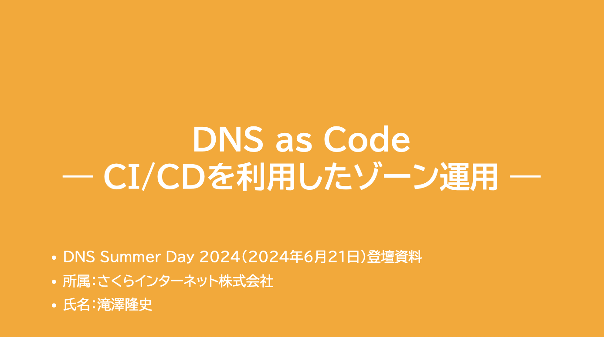

# “DNS as Code”のツールを利用したゾーン移転
<!--
class: title
_header: ""
_footer: ""
_paginate: false
-->

- DNS Summer Day 2025（2025年6月27日）登壇資料
- 所属：さくらインターネット株式会社
- 氏名：滝澤隆史

## 自己紹介
<!--
class: body
-->

- 氏名：滝澤隆史
- 所属：さくらインターネット株式会社
    - さくらのクラウドの中の人をやっている
- DNSとの関わり
    - 趣味として何となくDNSで遊んでいる人

## 概要

- “DNS as Code”とは
- “DNS as Code”のツールを利用したゾーン移転
- DNSControl
- octoDNS

## “DNS as Code”とは
<!--
class: heading
-->

### DNS Summar Day 2024
<!--
class: body
-->

- 『DNS as Code — CI/CDを利用したゾーン運用 —』

### “DNS as Code”とは

- 2017年から登場した言葉のようである
- Infrastructure as CodeをDNSに特化したもの
- DNSゾーンの状態をコードで定義し、APIによりDNSゾーンに反映させる

### “DNS as Code”の実装

- DNSControl
- octoDNS

### DNSControlとは

- Stack Exchange社が開発・保守しているDNSゾーンの保守ツール
- 公式サイト
    - https://docs.dnscontrol.org/
- 設定ファイルに記述されたゾーンデータをAPIでDNSプロバイダーに反映させる

### octoDNSとは

- GitHub社が開発・保守しているDNSゾーンの保守ツール
- 公式サイト
    - https://github.com/github/octodns
- ソースとして指定したDNSプロバイダーのゾーンデータをAPIでターゲットのDNSプロバイダーに反映させる

### DNSControlとoctoDNSの主な特徴

- ゾーンをコードとして記述するテキストファイル
    - DNSControl: JavaScript
    - octoDNS: YAML
- 複数のDNSプロバイダーに対応
- 既存のDNSプロバイダーからのインポートに対応
- プレビュー/dry-run機能により実際に登録されているゾーンデータからの更新内容の確認

### コード（テキストファイル）であることの利点

- コメントを記述できる
- Gitのようなバージョン管理システムを利用できる
- GitHubやGitLabのようなバージョン管理システムのプラットフォームを利用できる

#### Gitのようなバージョン管理システムを利用できる

- 変更履歴や変更理由を残せる
- 変更内容（差分）を確認できる
- 問題発生時に切り戻しができる

#### GitHubやGitLabのようなバージョン管理システムのプラットフォームを利用できる

- レビューや承認ができる
    - プルリクエストやマージリクエスト
- CI（継続的インテグレーション）が利用できる
    - 構文チェック
    - 更新内容の確認（プレビュー/dry-run機能の利用）
- CD（継続的デリバリー）が利用できる
    - DNSプロバイダーへのゾーンの反映

## “DNS as Code”のツールを利用したゾーン移転
<!--
class: heading
-->

### ゾーン移転のフロー
<!--
class: body
-->

1. ツールの設定ファイルを記述する
2. 移転元DNSプロバイダーからゾーンデータを取得する
3. （必要であれば）設定ファイルやゾーンデータファイルを修正する
4. 移行先DNSプロバイダーにゾーンデータの内容を反映する
5. ファイルの内容と移転先DNSプロバイダーのゾーンを比較し確認する

### 注意点

- HTTPSやSVCBのような新しめのリソースレコードタイプを利用しているときにはゾーンデータの取得や反映にはDNSControlを利用する

### ツールの設定ファイルを記述する

