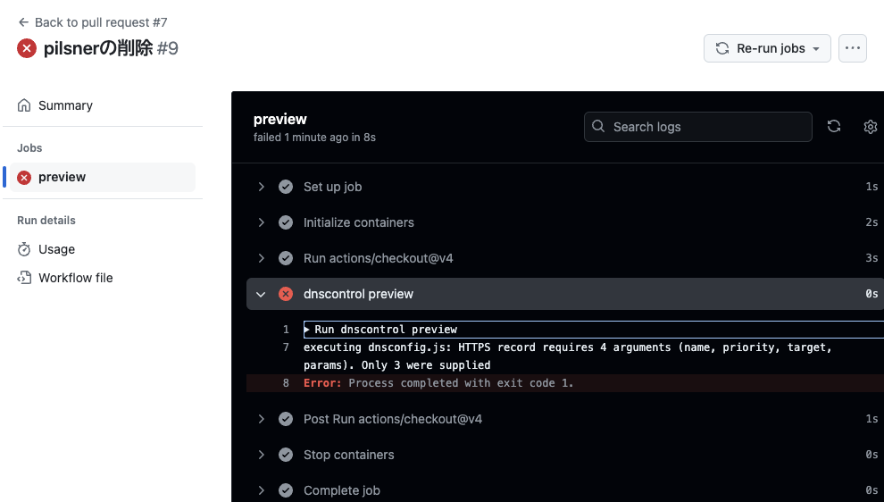

# DNS as Code<br>— CI/CDを利用したゾーン運用 —
<!--
class: title
_header: ""
_footer: ""
_paginate: false
-->

- DNS Summer Day 2024（2024年6月21日）登壇資料
    - 2025-07-25 最終更新
- 所属：さくらインターネット株式会社
- 氏名：滝澤隆史

## 自己紹介
<!--
class: body
-->

- 氏名：滝澤隆史
- 所属：さくらインターネット株式会社
    - 2024年2月から
    - クラウドの中の人をやっている
- DNSとの関わり
    - 趣味として何となくDNSで遊んでいる人

## 概要

- クラウド時代におけるDNSゾーン運用の課題
- “DNS as Code”とは
- “DNS as Code”の実装
    - DNSControl
    - octoDNS
- CI/CDを利用したゾーン運用

## クラウド時代におけるDNSゾーン運用の課題
<!--
class: heading
-->

### クラウド時代におけるDNSゾーン運用
<!--
class: body
-->

- マネージドDNSサービスを利用することが主流になっている
- APIを利用可能なサービス
    - サービスプロバイダーからSDK（ソフトウェア開発キット）やツールが提供されていれば、それを利用してゾーンを運用できる
    - SDKやツールはクラウドサービスを統合管理して利用するには便利だが、DNSゾーンの運用に利用するには煩雑である
- 結局、WebUI（コントロールパネル）を利用している人が多いでしょう

### WebUI（コントロールパネル）起因による課題

- 変更管理ができない
    - 変更履歴や変更理由を残せない
        - いつ誰が何をなぜ変更したのか
    - 変更内容（差分）を確認できない
    - 問題発生時に切り戻しができない
    - レビューや承認ができない
- コメントを記述できない

#### WebUI（コントロールパネル）起因による課題の対策

- WebUI（コントロールパネル）を使わない
- ゾーンデータを手元でテキストファイルとして運用し、APIを利用してDNSサービスに反映させる
    - 変更管理に起因する課題
        - GitHubやGitLabのようなバージョン管理システムのプラットフォームを利用することで解決する
    - コメントの課題
        - コメントを記述できるフォーマットを利用すれば解決する

### マネージドDNSサービスの大規模障害による課題

- 大規模障害が発生したとき
    - 運用しているDNSゾーンに関する名前解決ができなくなる
    - 運営しているサービスに影響がでる
- ゾーンデータの保管
    - 一次情報としてのゾーンデータはマネージドDNSサービスにあり、手元にはない
        - 運用でカバー
            - スプレッドシート管理（辛い） 
    - ゾーンデータを取り出したいときに取り出せるとは限らない
        - 障害時に取り出せるとは思えない

#### マネージドDNSサービスの大規模障害による課題の対策、その1

- あらかじめ他のマネージドDNSサービスに切り替えられる準備をしておく
    - 障害時にゾーンデータを取り出せるとは限らない
    - 一次情報としてゾーンデータを手元に持ち、APIを利用して、手元のゾーンデータをマネージドDNSサービスに反映させる
    - 大規模障害時にはゾーンデータの反映先のマネージドDNSサービスを切り替える

#### マネージドDNSサービスの大規模障害による課題の対策、その2

- あらかじめ複数のマネージドDNSサービスを利用する
    - WebUI（コントロールパネル）による運用は無理がある
    - 一次情報としてゾーンデータを手元に持ち、APIを利用して、手元のゾーンデータを複数のマネージドDNSサービスに反映させる

### 課題の対策のまとめ

- 一次情報としてゾーンデータを手元に持つ
- APIを利用して、手元のゾーンデータをマネージドDNSサービスに反映させる

### “DNS as Code”

> APIを利用して、手元のゾーンデータをマネージドDNSサービスに反映させる

- どこかで見た光景
    - ITインフラの状態をコードで定義し、APIによりITインフラに反映させる
    - → Infrastructure as Code
- DNSに特化する
    - 「インフラ」を「DNSゾーン」に置き換える
    - DNSゾーンの状態をコードで定義し、APIによりDNSゾーンに反映させる
    - → “DNS as Code”

## “DNS as Code”とは
<!--
class: heading
-->

### “DNS as Code”とは
<!--
class: body
-->

- “DNS as Code”を明確に定義した文章はない
- “DNS as Code”に言及している情報を見ていく

### DNSControl: A DSL for DNS as Code from StackOverflow.com

- 2017年3月14日、SREcon17 Americas
- Stack OverflowのSREチームのスタッフによるDNSControlの紹介
- 同日、DNSControlをオープンソースソフトウェアとして公開
- https://www.usenix.org/conference/srecon17americas/program/presentation/peterson


### octoDNS - README.md(v0.8.0)

- 2017年3月16日、octoDNS公開
- 公開当初（v0.8.0）のREADME.mdの見出しに「DNS as code - Tools for managing DNS across multiple providers」という記述がある
- https://github.com/octodns/octodns/blob/7957a4c018f729e47ce976fa89f065284b959a52/README.md


### Introducing DnsControl – “DNS as Code” has Arrived

- 2017年4月11日、Stack Exchange社のブログでDNSControlを紹介
- 記事のタイトルに“DNS as Code”が含まれている
- https://blog.serverfault.com/2017/04/11/introducing-dnscontrol-dns-as-code-has-arrived/


### DevOps and DNS

- 2017年7月、Andy Still (Intechnica), Phil Stanhope (Oracle Dyn)によるO'Reilly Mediaのレポート
- “Chapter 4. Managing DNS in a DevOps Culture”に“DNS as Code”についての言及がある
- https://www.oreilly.com/library/view/devops-and-dns/9781492049241/


#### DevOps and DNS

- 該当箇所を要約すると
    - （DevOpsの文脈で）すべてのDNSの変更を動的にAPIで管理できるようになれば、すべてのDNSレコードを含めるようにInfrastructure as Codeを拡張し、コードの変更管理をし始めることが次の段階だ
- 注意）O’Reilly learning platformのサブスクリプションが必要

### DNS as Code

- 2020年6月、Akamai社のブログ
- Edge DNSのDNSゾーンの管理にTerraformを利用する例を紹介している
- https://www.akamai.com/blog/security/dns-as-code-


### “DNS as Code”とは結局は何なのか

- 2017年から登場した言葉のようである
- Infrastructure as CodeをDNSに特化したもの
- DNSゾーンの状態をコードで定義し、APIによりDNSゾーンに反映させる

### なぜ2017年から登場したのか

- 2016年10月のマネージドDNSサービスプロバイダーのDynへの大規模DDoSがきっかけ


#### How Stack Overflow plans to survive the next DNS attack

- 2017年1月に公開されたStack Exchange社のブログ
- 2016年10月のDynへの大規模DDoS攻撃を背景として、次に同様な攻撃が発生したときにどのようなアプローチをとれるかを検討した記事
- https://blog.serverfault.com/2017/01/09/surviving-the-next-dns-attack/


#### “DNS as Code”の実装が公開

- 2017年3月14日：DNSControl v0.1.0公開
- 2017年3月16日：octoDNS v0.8.0公開

### DNSControlとoctoDNSの主な特徴

- ゾーンをコードとして記述するテキストファイル
    - DNSControl: JavaScript
    - octoDNS: YAML、マスターファイル
- 複数のDNSプロバイダーに対応
- 既存のDNSプロバイダーからのインポートに対応
- プレビュー/dry-run機能により実際に登録されているゾーンデータからの更新内容の確認

### コード（テキストファイル）であることの利点

- コメントを記述できる
- Gitのようなバージョン管理システムを利用できる
- GitHubやGitLabのようなバージョン管理システムのプラットフォームを利用できる

#### Gitのようなバージョン管理システムを利用できる

- 変更履歴や変更理由を残せる
- 変更内容（差分）を確認できる
- 問題発生時に切り戻しができる

#### GitHubやGitLabのようなバージョン管理システムのプラットフォームを利用できる

- レビューや承認ができる
    - プルリクエストやマージリクエスト
- CI（継続的インテグレーション）が利用できる
    - 構文チェック
    - 更新内容の確認（プレビュー/dry-run機能の利用）
- CD（継続的デリバリー）が利用できる
    - DNSプロバイダーへのゾーンの反映

## DNSControl
<!--
class: heading
-->

### DNSControlとは
<!--
class: body
-->

- Stack Exchange社が開発・保守しているDNSゾーンの保守ツール
    - Stack Exchange社はStack Overflow（開発者向けのQ&Aサイト）やServer Fault（システム・ネットワーク管理者向けのQ&Aサイト）の運営元
- 公式サイト
    - https://docs.dnscontrol.org/

### 背景・経緯

- 2016年10月：Dynへの大規模DDoS
- 2017年1月9日：ブログ記事『[How Stack Overflow plans to survive the next DNS attack](https://blog.serverfault.com/2017/01/09/surviving-the-next-dns-attack/)』
- 2017年3月14日：SREcon17 Americas『[DNSControl: A DSL for DNS as Code from StackOverflow.com](https://www.usenix.org/conference/srecon17americas/program/presentation/peterson)』
- 2017年3月14日：v0.1.0公開
- 2017年4月11日：ブログ記事『[Introducing DnsControl – “DNS as Code” has Arrived](https://blog.serverfault.com/2017/04/11/introducing-dnscontrol-dns-as-code-has-arrived/)』

### DNSControlが行うこと

- 設定ファイルに記述されたゾーンデータをAPIでDNSプロバイダーに反映させる


### 複数のDNSプロバイダーへの対応

- 複数のDNSプロバイダーにも反映できる


### 対応しているマネージドDNSサービスプロバイダー

- Akamai Edge DNS
- Amazon Route 53
- Azure DNS
- Cloudflare
- Google Cloud DNS
- Sakura Cloud（さくらのクラウド）
- 他、40プロバイダー以上
※注記）本資料の実行例は「さくらのクラウド　DNSアプライアンス」対応のDNSControl用のプロバイダー（滝澤が開発中）を利用したものであり、~~現時点では正式リリースはされていない。~~ 2024-09-07追記：DNSControl v4.13.0でさくらのクラウドがサポートされた

### 対応しているその他のDNSプロバイダー

- AXFR+DDNS
    - ゾーンの取得にゾーン転送を、更新にDynamic Updateを利用
- BIND
    - マスターファイルを更新
- DNS-over-HTTPS
    - NSレコードが正しいか確認するだけの機能
- Microsoft DNS Server on Microsoft Windows Server
- PowerDNS

### DNSControlの設定ファイル

- creds.json：DNSプロバイダー設定（認証情報含む）
- dnsconfig.js：ゾーン設定

#### DNSプロバイダー設定（認証情報含む）

- creds.json

```json
{
  "sakuracloud": {
    "TYPE": "SAKURACLOUD",
    "access_token": "$SAKURACLOUD_ACCESS_TOKEN",
    "access_token_secret": "$SAKURACLOUD_ACCESS_TOKEN_SECRET"
  }
}
```

- ここでの`sakuracloud`はDNSプロバイダーを指定する任意の名前
- `TYPE`はDNSプロバイダーのタイプ識別子
- 他のパラメーターは認証情報やAPIに関連するもので、DNSプロバイダーにより異なる

#### ゾーン設定（レジストラー、DNSプロバイダー指定）

- dnsconfig.js

```javascript
var REG_NONE = NewRegistrar("none");
var DSP_SAKURACLOUD = NewDnsProvider("sakuracloud");
```

- ゾーンの設定はJavaScriptの記法で行う
- マクロとして利用できる関数や修飾子が用意されている
- `NewRegistrar`にはレジストラーを指定する。なければ、`none`を指定する
- `NewDnsProvider`にはcreds.jsonに記述したDNSプロバイダーを指定する

#### ゾーン設定（ゾーンデータ）

- dnsconfig.js

```javascript
D("dnsbeer.com", REG_NONE, DnsProvider(DSP_SAKURACLOUD),
  DefaultTTL(3600),
  HTTPS("@", 1, "pale-ale.dnsbeer.com.", ""),
  A("pale-ale", "192.0.2.1"),
END);
```

- ゾーンは関数`D`の引数として記述し、引数は`END`で終わる
- ゾーン名（“.”で終わらない）、レジストラー、DNSプロバイダーを指定する
- リソースレコードタイプごとの修飾子を使ってリソースレコードを記述する
- リソースレコードタイプによってはRDATAをそのまま記述するのではなく、要素ごとに記述する

### DNSControlによるDNSプロバイダーへの反映の実行例

- 実行例からどういうことができるかを確認する


#### 変更前の状態

- 次のリソースレコードが登録されているとする（コントロールパネル）


#### 設定内容

- dnsconfig.jsの内容

```javascript
var REG_NONE = NewRegistrar("none");
var DSP_SAKURACLOUD = NewDnsProvider("sakuracloud");

D("dnsbeer.com", REG_NONE, DnsProvider(DSP_SAKURACLOUD),
  DefaultTTL(3600),
  HTTPS("@", 1, "pale-ale.dnsbeer.com.", ""),
  A("pale-ale", "192.0.2.1"),
END);
```

- HTTPSレコードの追加
- pilsnerのAレコードの削除
- TTLをデフォルト値に変更

#### プレビュー

```sh
dnscontrol preview
```


- 作成、更新、削除されるリソースレコードが出力される
- 各種チェックも行う
    - 構文チェック、MX/CNAMEの絶対ドメイン名チェック

#### DNSプロバイダーへの反映

```sh
dnscontrol push
```


- 作成、更新、削除されるリソースレコードが表示され、DNSプロバイダーに反映される

#### 反映したことの確認

- コントロールパネル


#### ゾーンデータの取得（マスターファイル形式）

```sh
dnscontrol get-zones --format=zone DNSプロバイダー - ゾーン
```


- ゾーンデータを取得できる

#### ゾーンデータの取得（DNSControlの形式）

```sh
dnscontrol get-zones --format=js DNSプロバイダー - ゾーン
```


- dnsconfig.jsの形式で取得できる
- DNSControlの新規利用開始時にこのコマンドを使うとよい

### JavaScript DSL

- JavaScriptのDSLであるため、変数や演算やマクロ関数が利用できる
- https://docs.dnscontrol.org/getting-started/examples

```javascript
var addrA = IP("1.2.3.4")

var DSP_R53 = NewDnsProvider("route53_user1");

D("example.com", REG_MY_PROVIDER, DnsProvider(DSP_R53),
    A("@", addrA), // 1.2.3.4
    A("www", addrA + 1), // 1.2.3.5
END);
```

- この他にも便利なマクロ関数が多く用意されている

## octoDNS
<!--
class: heading
-->

### octoDNSとは
<!--
class: body
-->

- GitHub社が開発・保守しているDNSゾーンの保守ツール
- 公式サイト
    - https://github.com/github/octodns

### 背景・経緯

- 2016年10月：Dynへの大規模DDoS
- 2017年3月16日：v0.8.0公開
- 2017年4月27日：ブログ記事『[Enabling DNS split authority with OctoDNS](https://github.blog/2017-04-27-enabling-split-authority-dns-with-octodns/)』
- 2017年5月31日：ブログ記事『[DNS Infrastructure at GitHub](https://github.blog/2017-05-31-dns-infrastructure-at-github/)』

### octoDNSが行うこと

- ソースとして指定したDNSプロバイダーのゾーンデータをAPIでターゲットのDNSプロバイダーに反映させる


### 複数のDNSプロバイダーへの対応

- 複数のDNSプロバイダーにも反映できる


### 対応しているマネージドDNSサービスプロバイダー

- Akamai Edge DNS
- Amazon Route 53
- Azure DNS
- Cloudflare DNS
- Google Cloud DNS
- 計23プロバイダー

※注記）本資料の実行例は「さくらのクラウド　DNSアプライアンス」対応のプロバイダーパッケージoctodns-sakuracloud（滝澤が開発中）を利用したものであり、~~現時点では正式リリースはされていない。~~
2025-02-19追記：v0.0.1がリリースされた。pipでインストールできる。

### 対応しているその他のDNSプロバイダー

- Rfc2136Provider/BindProvider
    - ゾーン転送＋Dynamic Update
- EtcHostsProvider
    - /etc/hosts
- PowerDNS
- YamlProvider
    - octoDNS独自のYAML形式のゾーンファイル

### 対応しているソース専用DNSプロバイダー

- EnvVarSource
    - 環境変数
- AxfrSource
    - ゾーン転送
- ZoneFileSource
    - マスターファイル
- TinyDnsFileSource
    - tinydns

### インストール

- DNSプロバイダーごとにPythonパッケージとして提供されているため、利用するDNSプロバイダーのパッケージをインストールする

    ```sh
    pip3 install octodns
    pip3 install パッケージ名
    ```

- 例えば、ゾーンファイルを利用したいときには次のようにする

    ```sh
    pip3 install octodns
    pip3 install octodns-bind
    ```

- パッケージの一覧は公式サイトの「Providers」に掲載されている
    - https://github.com/octodns/octodns#providers

### octoDNSの設定ファイル

- YAML形式の設定ファイル
    - 設定ファイルは次の2つから構成される
        - providers：DNSプロバイダー設定（認証情報含む）
        - zones：ゾーンごとのDNSプロバイダーの指定

        ```yaml
        ---
        providers:
          ...
        zones:
          ...
        ```

#### DNSプロバイダー設定（認証情報含む）

```yaml
providers:
  zonefile:
    class: octodns_bind.ZoneFileSource
    directory: ./zones
    file_extension: .zone
    check_origin: false
  sakuracloud:
    class: octodns_sakuracloud.SakuraCloudProvider
    access_token: env/SAKURACLOUD_ACCESS_TOKEN
    access_token_secret: env/SAKURACLOUD_ACCESS_TOKEN_SECRET
```

- `zonefile`や`sakuracloud`はDNSプロバイダーを指定する任意の名前
- `class`はDNSプロバイダーのクラス（開発言語Pythonのクラス）
- 他のパラメーターは認証情報などのもので、DNSプロバイダーにより異なる

#### ゾーンごとのDNSプロバイダーの指定

```yaml
zones:
  '*':
    sources:
      - zonefile
    targets:
      - sakuracloud
```

- `sources`にソースDNSプロバイダー、`targets`にターゲットDNSプロバイダーを指定する
- 動的ゾーン構成（Dynamic Zone Config）の例であるため、ゾーン名は`*`になっている
- 静的ゾーン構成（Static Zone Config）の場合は、`example.com.`（`.`で終わる）のようなゾーン名になる

### ゾーンファイル

- バージョン管理システムの利用やCI/CDの利用を考慮すると、ソースDNSプロバイダーとしては以下のどちらかを利用することになる
    - YamlProvider（YAML形式のゾーンファイル）
    - ZoneFileSource（マスターファイル）

#### ゾーンファイル（YamlProvider）

```yaml
---
"":
  ttl: 3600
  type: HTTPS
  value:
    svcparams: {}
    svcpriority: 0
    targetname: pale-ale.dnsbeer.com.
pale-ale:
  ttl: 3600
  type: A
  value: 192.0.2.1
```

- `value`（1個の場合）あるいは`values`（複数の場合）はリソースレコードタイプにより記述形式が異なる


#### ゾーンファイル（ZoneFileSource）

- マスターファイル形式のゾーンファイルを利用できる
- ただし、利用できるリソースレコードタイプには制限がある
    - A, AAAA, CAA, CNAME, LOC, MX, NS, PTR, SPF, SRV, SSHFP, TLSA, TXT
- ターゲットDNSプロバイダーにおいて、ゾーン頂点のSOAレコードやNSレコードが変更できないときには次の設定を追加する
    - `check_origin: false`


### CLIツール

- octodns-sync

    ```sh
    octodns-sync --config-file=config.yaml --doit
    ```

    - ソースDNSプロバイダーのゾーンデータをターゲットDNSプロバイダーにAPIで同期する
    - デフォルトはdry-runで動作する
    - `--doit`オプションを付けることでDNSプロバイダーに反映させる

### octoDNSによるDNSプロバイダーへの反映の実行例

- 実行例からどういうことができるかを確認する

#### 変更前の状態

- 次のリソースレコードが登録されているとする（コントロールパネル）


#### マスターファイル

- zones/dnsbeer.com.zone

    ```
    $TTL 3600
    pale-ale    IN  A       192.0.2.1
    porter      IN  A       192.0.2.3
    ```

- pilsnerのAレコードの削除
- porterのAレコードの追加
- TTLの変更

#### dry-runの実行

- デフォルトはdry-runとして動作する

```sh
$ octodns-sync --config-file=config.yaml
...
**********************************************************************
* dnsbeer.com.
**********************************************************************
* sakuracloud (SakuraCloudProvider)
*   Delete <ARecord A 1800, pilsner.dnsbeer.com., ['192.0.2.2']>
*   Create <ARecord A 3600, porter.dnsbeer.com., ['192.0.2.3']> ()
*   Update
*     <ARecord A 1800, pale-ale.dnsbeer.com., ['192.0.2.1']> ->
*     <ARecord A 3600, pale-ale.dnsbeer.com., ['192.0.2.1']> ()
*   Summary: Creates=1, Updates=1, Deletes=1, Existing Records=2
**********************************************************************
...
```

#### DNSプロバイダーへの反映

- 実際に反映するためには`--doit`オプションを付ける

```sh
$ octodns-sync --config-file=config.yaml --doit
...
**********************************************************************
* dnsbeer.com.
**********************************************************************
* sakuracloud (SakuraCloudProvider)
*   Delete <ARecord A 1800, pilsner.dnsbeer.com., ['192.0.2.2']>
*   Create <ARecord A 3600, porter.dnsbeer.com., ['192.0.2.3']> ()
*   Update
*     <ARecord A 1800, pale-ale.dnsbeer.com., ['192.0.2.1']> ->
*     <ARecord A 3600, pale-ale.dnsbeer.com., ['192.0.2.1']> ()
*   Summary: Creates=1, Updates=1, Deletes=1, Existing Records=2
**********************************************************************

2024-06-18T10:15:54  [8456129536] INFO  SakuraCloudProvider[sakuracloud] 
apply: making 3 changes to dnsbeer.com.
2024-06-18T10:15:55  [8456129536] INFO  Manager sync:   3 total changes
```

#### 反映したことの確認

- コントロールパネル


### ゾーンデータの取得（YAML形式）

- octodns-dumpを利用して、YAML形式で取得できる
- octoDNSの新規利用開始時にこのコマンドを使うとよい

```sh
$ octodns-dump --config-file config.yaml --output-dir zones 
 dnsbeer.com. sakuracloud
...

$ cat zones/dnsbeer.com.yaml 
---
pale-ale:
  type: A
  value: 192.0.2.1
porter:
  type: A
  value: 192.0.2.3
```

## CI/CDを利用したゾーン運用
<!--
class: heading
-->


### GitHubやGitLabのようなバージョン管理システムのプラットフォームの利用
<!--
class: body
-->

1. リポジトリのフォーク
2. git pull
3. ブランチ作成
4. ゾーンファイルの編集
5. git commit、git push

### GitHubやGitLabのようなバージョン管理システムのプラットフォームの利用

6. プルリクエストやマージリクエストの作成
7. CI（継続的インテグレーション）
    - 構文チェック
    - 更新内容の出力（プレビュー/dry-run機能の利用）
8. レビュー、承認
9. マージ
10. CD（継続的デリバリー）
    - DNSプロバイダーへのゾーンの反映

### GitHub Actionsでの利用例の紹介

- GitHub Actionsとは
    - GitHubの継続的インテグレーションと継続的デリバリー (CI/CD) のプラットフォーム
- GitHub Actionsを利用してDNSControlによるゾーン運用の例

### GitHubのリポジトリに対して事前に行うこと

- デフォルトブランチ（main）に対してルールを設定する
    - Settings → Rules → Ruleset
        - ☑Require a pull request before merging
            - Required approvals: 1 ←承認が必要な場合
        - ☑Require status checks to pass
            - Status checks that are required
                - PR時に実行するGitHub Actionsを指定
- DNSプロバイダーで利用する認証情報をシークレットとして登録する
    - Settings → Secrets and variables → Actions
        - Repository secrets

### リポジトリのファイル構成

- creds.json - DNSプロバイダー設定（認証情報含む）
- dnsconfig.js - ゾーンファイル
- .github/
    - workflows/
        - preview.yml - Pull Request作成・更新時に実行する
        - push.yml - マージしたときに実行する

### creds.json - DNSプロバイダー設定

- 認証情報を環境変数から取得するように設定する

```json
{
  "sakuracloud": {
    "TYPE": "SAKURACLOUD",
    "access_token": "$SAKURACLOUD_ACCESS_TOKEN",
    "access_token_secret": "$SAKURACLOUD_ACCESS_TOKEN_SECRET"
  }
}
```

### preview.yml

- Pull Request作成時・更新時にワークフローを実行し、プレビューを行う

```yaml
name: preview
on:
  pull_request:
    branches: [ 'main' ]
    paths: [ 'creds.json', 'dnsconfig.js' ]
jobs:
  preview:
    runs-on: ubuntu-latest
    container:
      image: ttkzw/dnscontrol
    steps:
      - uses: actions/checkout@v4
      - name: dnscontrol preview
        run: dnscontrol preview
        env:
          SAKURACLOUD_ACCESS_TOKEN: ${{ secrets.SAKURACLOUD_ACCESS_TOKEN }}
          SAKURACLOUD_ACCESS_TOKEN_SECRET: ${{ secrets.SAKURACLOUD_ACCESS_TOKEN_SECRET }}
```

### push.yml

- mainブランチにマージするときにワークフローを実行し、ゾーンデータをDNSプロバイダーに反映する

```yaml
name: push
on:
  push:
    branches: [ 'main' ]
    paths: [ 'creds.json', 'dnsconfig.js' ]
jobs:
  push:
    runs-on: ubuntu-latest
    container:
      image: ttkzw/dnscontrol
    steps:
      - uses: actions/checkout@v4
      - name: dnscontrol push
        run: dnscontrol push
        env:
          SAKURACLOUD_ACCESS_TOKEN: ${{ secrets.SAKURACLOUD_ACCESS_TOKEN }}
          SAKURACLOUD_ACCESS_TOKEN_SECRET: ${{ secrets.SAKURACLOUD_ACCESS_TOKEN_SECRET }}
```

### 実行例

```javascript
D("dnsbeer.com", REG_NONE, DnsProvider(DSP_SAKURACLOUD),
  DefaultTTL(3600),
  A("pale-ale", "192.0.2.1", TTL(1800)),
  A("pilsner", "192.0.2.2"),
END);
```

↓

```javascript
D("dnsbeer.com", REG_NONE, DnsProvider(DSP_SAKURACLOUD),
  DefaultTTL(3600),
  HTTPS("@", 1, "pale-ale.dnsbeer.com.", ""),
  A("pale-ale", "192.0.2.1"),
END);
```

#### git diff

```diff
$ git diff
diff --git a/dnsconfig.js b/dnsconfig.js
index 5d7717b..151134f 100644
--- a/dnsconfig.js
+++ b/dnsconfig.js
@@ -3,6 +3,6 @@ var DSP_SAKURACLOUD = NewDnsProvider("sakuracloud");
 
 D("dnsbeer.com", REG_NONE, DnsProvider(DSP_SAKURACLOUD),
   DefaultTTL(3600),
-  A("pale-ale", "192.0.2.1", TTL(1800)),
-  A("pilsner", "192.0.2.2"),
+  HTTPS("@", 1, "pale-ale.dnsbeer.com.", ""),
+  A("pale-ale", "192.0.2.1"),
 END);
```

#### git commit & push

```sh
$ git commit -a -m "pilsnerの削除"
[test 3e06266] pilsnerの削除
 1 file changed, 2 insertions(+), 2 deletions(-)

$ git push origin HEAD
Enumerating objects: 5, done.
Counting objects: 100% (5/5), done.
Delta compression using up to 8 threads
Compressing objects: 100% (3/3), done.
Writing objects: 100% (3/3), 370 bytes | 370.00 KiB/s, done.
Total 3 (delta 2), reused 0 (delta 0), pack-reused 0
remote: Resolving deltas: 100% (2/2), completed with 2 local objects.
To github.com:ttkzw/dns-as-code-example.git
   bfe0ed3..3e06266  HEAD -> test
```

#### Pull Request作成


#### Pull Request作成


#### Pull Request作成完了

- Pull Request時のワークフローpreviewが実行される


#### Pull Request時のGitHub Actionsの実行結果


#### マージ

- マージ時（mainブランチへのpush時）のワークフローpushが実行される


#### マージ時のGitHub Actionsの実行結果


#### 失敗時のPull Request画面


#### 失敗時のGitHub Actions



#### 承認を必要とする設定をしたとき


## まとめ
<!--
class: heading
-->

### まとめ
<!--
class: body
-->

- “DNS as Code”
    - Infrastructure as CodeをDNSに特化したもの
    - DNSゾーンの状態をコードで定義し、APIによりDNSゾーンに反映させる
    - CI/CDによるゾーンの運用ができる
- “DNS as Code”の主要な実装であるDNSControlとoctoDNSの紹介
- GitHub ActionsとDNSControlを利用したCI/CDの例の紹介

## おまけ
<!--
class: heading
-->

### おまけ
<!--
class: body
-->

登壇時間内に収まりきらなかった資料をおまけとして掲載する。

- DNS as Codeの実装
- DNSControlの注意点
- octoDNSの注意点
- 複数のマネージドDNSサービスの利用上の注意点
- 編集環境の注意点
- DNSプロバイダーパッケージの作成

## DNS as Codeの実装
<!--
class: heading
-->

### DNS as Codeの実装
<!--
class: body
-->

- クラウドサービスプロバイダー提供プロビジョニングツール
- [Terraform](https://www.terraform.io/)/[OpenTofu](https://opentofu.org/)
- [DNSControl](https://github.com/StackExchange/dnscontrol)
- [octoDNS](https://github.com/octodns/octodns)

### リソースレコードの記述例

- リソースレコードの記述しやすさ
    - リソースレコードの数が少なけば、それほど問題にならない
    - リソースレコードの数が多いと、記述しやすさは重要である
- リソースレコードの記述例をそれぞれの公式ドキュメントから見てみる

#### AWS CloudFormation (Amazon Route 53)

```json
"myDNSRecord" : {
  "Type" : "AWS::Route53::RecordSet",
  "Properties" : 
  {
    "HostedZoneId" : "Z3DG6IL3SJCGPX",
    "Name" : "mysite.example.com.",
    "Type" : "SPF",
    "TTL" : "900",
    "ResourceRecords" : [ "\"v=spf1 ip4:192.168.0.1/16 -all\"" ]
  }
}
```

https://docs.aws.amazon.com/AWSCloudFormation/latest/UserGuide/quickref-route53.html

#### Azure Resource Manager template (Azure DNS)

```json
    {
      "type": "Microsoft.Network/dnsZones/A",
      "apiVersion": "2018-05-01",
      "name": "[format('{0}/{1}', parameters('zoneName'), parameters('recordName'))]",
      "properties": {
        "TTL": 3600,
        "ARecords": [
          {
            "ipv4Address": "1.2.3.4"
          },
          {
            "ipv4Address": "1.2.3.5"
          }
        ]
      },
略
    }
```

https://learn.microsoft.com/en-us/azure/dns/dns-get-started-template

#### Google Cloud Deployment Manager (Google Cloud DNS)

```yaml
- name: {{ properties["rrsetName"] }}
  type: gcp-types/dns-v1:resourceRecordSets
  properties:
    name: {{ properties["rrsetDomain"] }}
    managedZone: $(ref.{{ properties["zoneName"] }}.name)
    records:
    - type: A
      ttl: 50
      rrdatas:
      - 10.40.10.0
```

https://github.com/GoogleCloudPlatform/deploymentmanager-samples/blob/master/google/resource-snippets/dns-v1/one_a_record.jinja

#### Terraform/OpenTofu (Amazon Route 53)

```h
resource "aws_route53_record" "www" {
  zone_id = aws_route53_zone.primary.zone_id
  name    = "www.example.com"
  type    = "A"
  ttl     = 300
  records = [aws_eip.lb.public_ip]
}
```

https://registry.terraform.io/providers/hashicorp/aws/latest/docs/resources/route53_record


#### Terraform/OpenTofu (Azure DNS)

```h
resource "azurerm_dns_a_record" "example" {
  name                = "test"
  zone_name           = azurerm_dns_zone.example.name
  resource_group_name = azurerm_resource_group.example.name
  ttl                 = 300
  records             = ["10.0.180.17"]
}
```

https://registry.terraform.io/providers/hashicorp/azurerm/latest/docs/resources/dns_a_record

#### Terraform/OpenTofu (Google Cloud DNS)

```h
resource "google_dns_record_set" "a" {
  name         = "backend.${google_dns_managed_zone.prod.dns_name}"
  managed_zone = google_dns_managed_zone.prod.name
  type         = "A"
  ttl          = 300

  rrdatas = ["8.8.8.8"]
}
```

https://registry.terraform.io/providers/hashicorp/google/latest/docs/resources/dns_record_set

#### DNSControl

- JavaScriptベースのDSL

```javascript
  A("test", "5.6.7.8")
```

https://github.com/StackExchange/dnscontrol

#### octoDNS

- YAML

```yaml
---
'':
  ttl: 60
  type: A
  values:
    - 1.2.3.4
    - 1.2.3.5
```

https://github.com/octodns/octodns

#### 【参考】マスターファイル（ゾーンファイル）

```
test 300 IN A 192.0.2.1
```

### リソースレコードの設定例のまとめ

- クラウドサービスプロバイダー提供プロビジョニングツールとTerraform/OpenTofu
    - プロバイダーにより記述方法が異なる
    - リソースレコードセットごとにリソースを定義するため、記述が冗長である
        - 数個だけであれば大変ではないが、100個あるときはどうだろうか
- DNSControlとoctoDNSとマスターファイル
    - DNSに特化しているため、記述が簡潔である


## DNSControlの注意点
<!--
class: heading
-->

### 注意点 - リソースレコードタイプ
<!--
class: body
-->

- SOA：ほとんどの場合はDNSプロバイダー側で管理しているため、記述不要
- NS：変更できないDNSプロバイダーの場合は記述不要
- ALIAS：疑似リソースレコードタイプはDNSプロバイダーが対応していれば利用できる
- TXT：SPFやDMARCを利用するときには`SPF_BUILDER`や`DMARC_BUILDER`を利用できる
- CAA：`CAA_BUILDER`を利用できる

#### SPF_BUILDER

- SPF用のTXTレコードを生成してくれる
- 10 DNS lookupsのチェックあり
- https://docs.dnscontrol.org/language-reference/domain-modifiers/spf_builder

```javascript
  SPF_BUILDER({
    label: "@",
    parts: [
      "v=spf1",
      "ip4:198.252.206.0/24", // ny-mail*
      "ip4:192.111.0.0/24", // co-mail*
      "include:_spf.google.com", // GSuite
      略
      "~all"
    ]
  }),
```

### 注意点 - フォーマッター

- PrettierやBiomeなどのフォーマッターを利用していると次のように整形されることがある
- ~~DNSControlにおいては最後の引数の末尾のカンマは許容されないので~~（2025-07-25追記: v4.15.0で許容された）、Trailing Commasの設定を`es5`にする

```javascript
D(
  "example.com",
  REG_MY_PROVIDER,
  DnsProvider(DSP_MY_PROVIDER),
  A("@", "192.0.2.1"),
  A("foo", "192.0.2.2"),
  END, ←このカンマは許容されない
);
```

#### JavaScriptのフォーマッターの設定

- Prettier (.prettier)

    ```json
    {
      "trailingComma": "es5"
    }
    ```

- Biome (biome.json)

    ```json
    {
      "javascript": {
        "formatter": { "trailingCommas": "es5" }
      }
    }
    ```


## octoDNSの注意点
<!--
class: heading
-->

### ゾーンデータの取得（マスターファイル形式）
<!--
class: body
-->

- マスターファイル形式としては取得できない
- ZoneFileSourceはソース専用のDNSプロバイダーであるため
- 試しにoctodns-dumpを実行するとエラーが発生する

```sh
$ octodns-dump --config-file config.yaml --output-dir zones 
 --output-provider zonefile dnsbeer.com. sakuracloud
...
octodns.manager.ManagerException: output_provider=zonefile, 
does not support copy method
```

### 注意点 - リソースレコードタイプ

- DNSプロバイダーによっては、ゾーン頂点のSOAレコードとNSレコードは扱えない
- DNSプロバイダーにより対応しているリソースレコードタイプは異なる
    - 特にHTTPSとSVCBはoctoDNSの公式ドキュメント上ではサポートされていない
        - DNSプロバイダーもサポートしていない
        - 内部的には扱えるようになっているので実はYamlProviderでは利用できる
- ALIASのような疑似リソースレコードタイプはDNSプロバイダーがサポートしていれば利用できる

### 注意点 - 安全機能

- ゾーンに10個以上のリソースレコードセットが存在するときに、次のそれぞれの場合は中断される
    - 全体の30%以上のリソースレコードセットが更新される場合
    - 全体の30%以上のリソースレコードセットが削除される場合
- `--force`オプションを付けて実行すると、この安全機能は無視される

```sh
$ octodns-sync --config-file config.yaml
...
octodns.provider.plan.TooMuchChange: [dnsbeer.com.] 
Too many updates, 100.00% is over 30.00% (10/10), force required
```

### 注意点 - APIリクエスト

- 1回のAPIリクエストで更新できるリソースレコードセットの数はDNSプロバイダーにより異なる
    - ゾーンのリソースレコードセットをまとめて更新できるもの
    - 複数のリソースレコードセットの更新を一度にできるもの
    - 1個のリソースレコードセットの更新しかできないもの
- 1回のリクエストで1個のリソースレコードセットしか更新できない場合は、リソースレコードセットの数だけAPIへのリクエストを行うため、更新に時間がかかる


### octoDNSのその他のコマンド

- octodns-compare
    - 2つのDNSプロバイダー間のゾーンを比較する
    - DNSプロバイダーの移行時のゾーン登録内容の比較にも利用できる
- octodns-report
    - ソースDNSプロバイダーのゾーンとDNS権威サーバーへのDNSクエリー結果を比較する
- octodns-validate
    - 設定ファイルを検査する
- octodns-versions
    - バージョンを表示して終了する


## 複数のマネージドDNSサービスの利用上の注意点
<!--
class: heading
-->

### 複数のマネージドDNSサービスの利用上の注意点
<!--
class: body
-->

- ゾーン頂点のNSレコードを追加できる必要がある
    - ゾーン頂点のNSレコードを追加・変更できないマネージドDNSサービスは多い
- レジストラーに登録できるNSレコードの数に制限がある
    - どのNSレコードを登録するか検討する
- マネージドDNSサービスによってリソースレコードの制限が異なる

## 編集環境の注意点
<!--
class: heading
-->

### 編集環境の注意点
<!--
class: body
-->

- 編集したときに以下のことが生じないようにする
    - タブとスペースが混在する
    - インデントのスペースの桁数が統一されていない
    - 最終行が改行で終わったり終わらなかったりする
- `.editorconfig`を用意し、リポジトリに含める

### .editorconfigの例

```ini
root = true

[*]
indent_style = space
indent_size = 2
tab_width = 2
end_of_line = lf
charset = UTF-8
trim_trailing_whitespace = true
insert_final_newline = true
```

### .editorconfigをサポートしていないエディター

プラグインを入れて利用できるようにすることを徹底させる。

- Vim用プラグイン
    - https://github.com/editorconfig/editorconfig-vim
    - Vim 9.0.1799, Neovim 0.9以降ではバンドルされている
- Emacs用プラグイン
    - https://github.com/editorconfig/editorconfig-emacs
- VSCode用エクステンション
    - https://marketplace.visualstudio.com/items?itemName=EditorConfig.EditorConfig

## DNSプロバイダーパッケージの作成
<!--
class: heading
-->

### DNSプロバイダーパッケージの作成
<!--
class: body
-->

- DNSプロバイダーがAPIを公開していれば、DNSプロバイダーパッケージを作成できる
- 開発言語
    - DNSControl: Go言語
    - octoDNS: Python
- 今回、実行例として利用したものはそれぞれ
    - とりあえず動くようにするだけであれば1、2日あればできる
    - DNSプロバイダーの制限に基づく例外的な処理とかテストとかドキュメント作成を加えて数日といったところ
    - 公開およびコントリビュート~~する予定~~した

### DNSControl

- 開発ドキュメントが用意されている
    - Code Style Guide
        - https://docs.dnscontrol.org/developer-info/styleguide-code
    - Writing new DNS providers
        - https://docs.dnscontrol.org/developer-info/writing-providers

### octoDNS

- 開発ドキュメントが十分には用意されていないので、他のプロバイダーパッケージを参考に開発する
- [octodns-template](https://github.com/octodns/octodns-template)を利用する
- `octodns.provider.base.BaseProvider`を継承したクラスを作成し、以下のメソッドを実装する
    - `__init__()`
        - 引数：self, id, 設定ファイルのパラメーター...
    - `list_zones()` - ゾーン名一覧を取得する
    - `populate()` - プロバイダーからゾーンデータを取得する
    - `_apply()` - プロバイダーにゾーンデータを反映する

### octoDNS

- 同クラスに以下のインスタンス変数を設定する
    - `SUPPORTS` - 対応しているリソースレコードタイプをset型として設定
    - `SUPPORTS_GEO`
    - `log` - ロガーを設定する
- 同クラスに以下のインスタンス変数・プロパティーを設定する。デフォルトがFalseなので対応していなければ設定しなくてもよい
    - `SUPPORTS_MULTIVALUE_PTR`
    - `SUPPORTS_POOL_VALUE_STATUS`
    - `SUPPORTS_ROOT_NS`
    - `SUPPORTS_DYNAMIC_SUBNETS`
    - `SUPPORTS_DYNAMIC`
